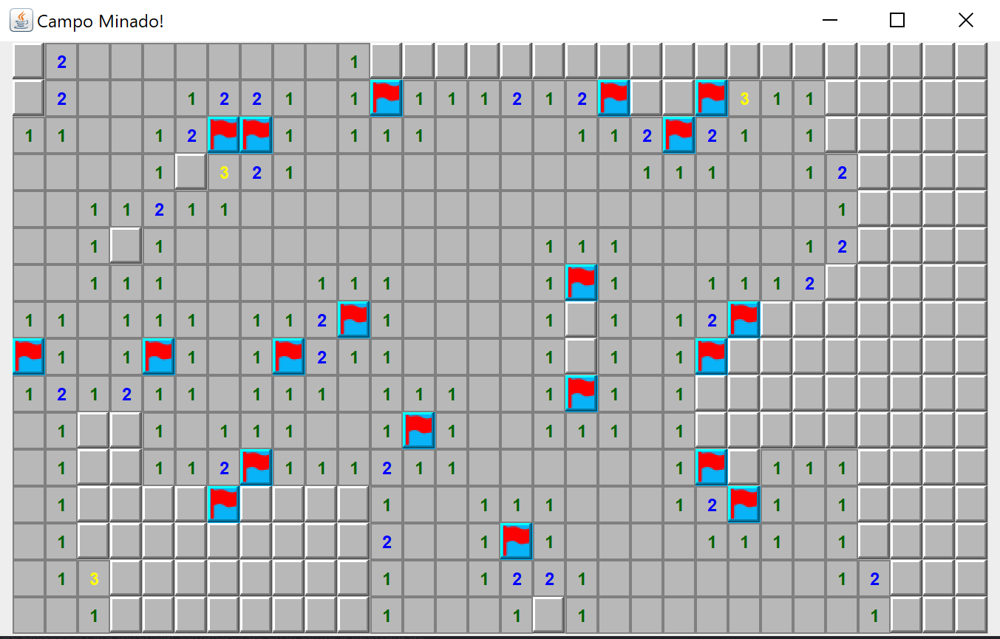

# Campo Minado com Java Swing

Este é um jogo de Campo Minado desenvolvido em Java durante o acompanhamento das aulas na plataforma Udemy. É um projeto de Campo Minado com uma interface gráfica desenvolvida em Java utilizando Swing. Ele é uma atualização de um projeto anterior que rodava no terminal, agora com uma interface gráfica mais intuitiva e interativa.

## Funcionalidades

- Interface gráfica amigável para o usuário.
- Sistema de marcas para sinalizar possíveis minas.
- Exibição de ícones personalizados para bombas e marcas.
- Mensagens de vitória e derrota com painéis personalizados.
- Suporte para reinicialização do jogo após vitória ou derrota.

## Instalação

1. Clone este repositório para o seu ambiente local:

   ```bash
   git clone https://github.com/Natzujj/campo-minado-swing.git
   ```

2. Navegue até o diretodio do projeto:
    ```bash
        cd campo-minado
    ```

3. Compile o projeto utilizando compilador Java (Ou Abra atraves de uma IDE):
    ```bash
        javac -d bin src/**/*.java
    ```

4. Execute o projeto (Ou Abra atraves de uma IDE):
    ```bash
        java TelaPrincipal
    ```

## Tecnologias Utilizadas

* Java: Linguagem de programação principal usada para desenvolver o jogo.
* POO (Programação Orientada a Objetos): Para modelar o jogo de maneira organizada e modular.
* Tratamento de Exceções: Para gerenciar condições de erro, como a abertura de uma mina.
* Swing: Biblioteca para construção da interface gráfica.

## Imagem Do jogo


## Licença
Este projeto está licenciado sob a licença MIT. Veja o arquivo LICENSE para mais detalhes.